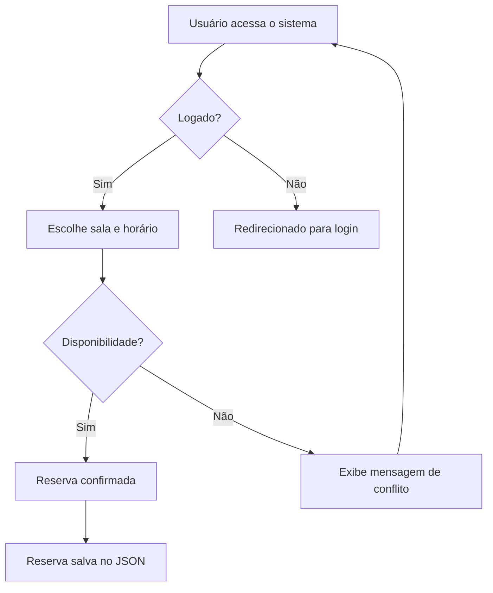

### **Documentação Completa do Sistema de Gestão de Salas**  

  

---

## **Índice**  
1. [Visão Geral](#visão-geral)  
2. [Principais Funcionalidades](#principais-funcionalidades)  
3. [Arquitetura do Sistema](#arquitetura-do-sistema)  
4. [Fluxograma do Sistema](#fluxograma-do-sistema)  
5. [Tecnologias Utilizadas](#tecnologias-utilizadas)  
6. [Estrutura do Sistema](#estrutura-do-sistema)  
7. [Requisitos](#requisitos)  
8. [Instalação e Configuração](#instalação-e-configuração)  
9. [Interface do Usuário](#interface-do-usuário)  
10. [Como Usar](#como-usar)  
11. [Padrões e Convenções](#padrões-e-convenções)  
12. [Contribuição](#contribuição)  
13. [Licença](#licença)  

---

## **Visão Geral**  

O **Sistema de Gestão de Salas** é uma aplicação web escalável e responsiva para gerenciamento de salas e reservas. Ele oferece funcionalidades robustas como:  
- Cadastro de salas e turmas.  
- Agendamento de horários com prevenção de conflitos.  
- Visualização clara de reservas.  
- Registro detalhado de logs e auditorias.  

A interface intuitiva e moderna, combinada com um backend eficiente, garante alto desempenho e facilidade de manutenção.  

---

## **Principais Funcionalidades**  

| Funcionalidade          | Descrição                                                                 |
|--------------------------|-------------------------------------------------------------------------|
| **Cadastro de Salas**    | Gerencie salas com informações como nome, capacidade e descrição.       |
| **Reserva de Horários**  | Agende horários com prevenção automática de conflitos.                 |
| **Mapa de Reservas**     | Visualize um calendário interativo com status de disponibilidade.      |
| **Gerenciamento de Turmas** | Vincule turmas às reservas e gerencie informações básicas.            |
| **Logs e Auditoria**     | Rastreie ações realizadas por usuários com informações detalhadas.      |
| **Configurações Avançadas** | Ajuste temas, horários de funcionamento e outras preferências do sistema. |

---

## **Arquitetura do Sistema**  

O sistema segue a **Arquitetura MVC (Model-View-Controller)** com camadas bem definidas:  

1. **Frontend**: Interface do usuário construída com HTML, JavaScript e Tailwind CSS.  
2. **Backend**: APIs em PHP para gerenciamento de dados.  
3. **Armazenamento**: Dados persistidos em arquivos JSON.  

  

---

## **Fluxograma do Sistema**  

### Processo de Reserva de Salas  



---

## **Tecnologias Utilizadas**  

| Tecnologia    | Uso                                            |
|---------------|------------------------------------------------|
| **HTML5**     | Estrutura básica do frontend.                 |
| **JavaScript**| Validações, interatividade e API calls.       |
| **Tailwind CSS** | Design responsivo e moderno.                |
| **PHP 7.4+**  | Lógica de negócios e endpoints da API.        |
| **JSON**      | Armazenamento inicial de dados.               |
| **Font Awesome** | Ícones para enriquecer a interface.          |

---

## **Estrutura do Sistema**  

### **Frontend**  
- **Público**  
  - `index.html`: Página inicial com mapa de reservas.  

- **Administrativo**  
  - `adminpanel.html`: Dashboard com acesso às funcionalidades principais.  
  - `salas.html`: Cadastro e gerenciamento de salas.  
  - `reservas.html`: Gerenciamento de reservas.  
  - `configuracoes.html`: Configuração do sistema.  

### **Backend**  
- **Autenticação**  
  - `login.php`: Login de usuários.  
  - `logout.php`: Finalização de sessões.  

- **APIs CRUD**  
  - `sala.php`: Operações de gerenciamento de salas.  
  - `reserva.php`: Operações de gerenciamento de reservas.  

---

## **Requisitos**  

| Requisito          | Descrição                          |
|---------------------|------------------------------------|
| **Servidor Web**    | PHP 7.4 ou superior.              |
| **Permissões**      | Escrita para diretórios de dados. |
| **Navegador**       | Compatível com HTML5 e JavaScript.|

---

## **Instalação e Configuração**  

1. Clone o repositório:  
   ```bash
   git clone https://github.com/seu-usuario/seu-repositorio.git
   ```  

2. Configure permissões:  
   ```bash
   chmod -R 755 /caminho/para/dados/
   ```  

3. Abra o navegador:  
   - URL: `http://localhost/seu-projeto`  

4. Use as credenciais padrão para login inicial:  
   - **Usuário:** `admin@sistema.local`  
   - **Senha:** `admin123`  

---

## **Interface do Usuário**  

  

---

## **Como Usar**  

### Cadastro de Salas  
1. Navegue para "Administração > Salas".  
2. Clique em "Adicionar Sala".  
3. Preencha os campos e clique em "Salvar".  

### Reserva de Horários  
1. Acesse "Administração > Reservas".  
2. Escolha uma sala e selecione o horário desejado.  
3. Confirme a reserva.  

### Configurações  
1. Acesse "Administração > Configurações".  
2. Altere preferências como tema e horários de funcionamento.  

---

## **Padrões e Convenções**  

- **Nomenclatura**:  
  - camelCase para funções e variáveis.  
  - PascalCase para classes.  

- **Segurança**:  
  - Sanitização de inputs.  
  - Autenticação baseada em tokens.  

- **Estilo de Código**:  
  - Indentação de 4 espaços.  
  - Respostas padronizadas em JSON.  

---

## **Contribuição**  

1. Faça um **fork** do repositório.  
2. Crie uma branch para suas alterações.  
3. Submeta um **Pull Request** detalhado.  

---

## **Licença**  

Este projeto é licenciado sob a [Licença](LICENSE).  
